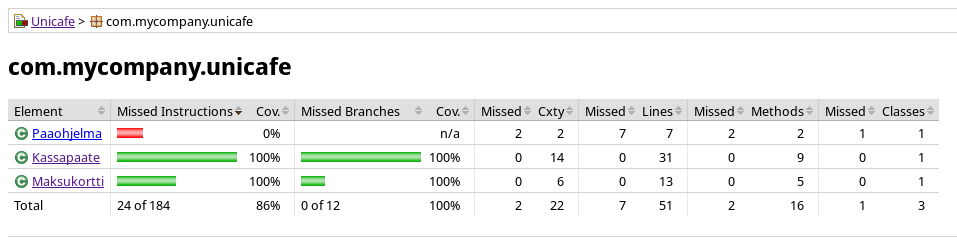

# Ohjelmistotekniikka

*Tähän* repositorioon tulee kurssin **ohjelmistotekniikka k2019** -suoritukseni.

[Linkki kurssimateriaaliin](https://github.com/mluukkai/ohjelmistotekniikka-kevat2019)

## Projektin dokumentaatio

[Työaikakirjanpito](doc/work_journal.md)

## Tehtävät (laskarit)

### Viikko 1

[gitlog.txt](laskarit/viikko1/gitlog.txt)

[komentorivi.txt](laskarit/viikko1/komentorivi.txt)

### Viikko 2

[Maksukortti](laskarit/viikko2/Maksukortti)

[Unicafe](laskarit/viikko2/Unicafe)

