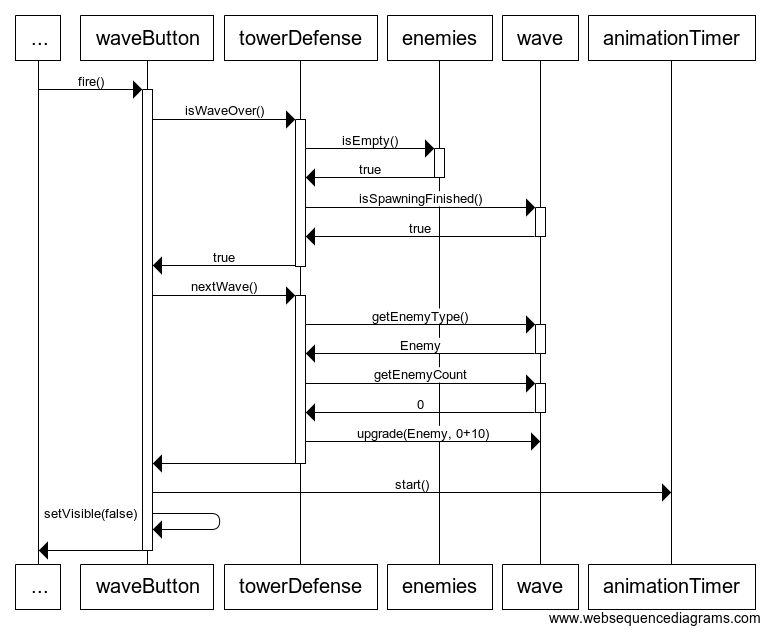

# Arkkitehtuurikuvaus

## Rakenne

Pelin rakenne kattaa kaksi pakkausta, `ui` ja `domain`. Pakkaukseen `ui` kuuluu
päämetodin luokka Main ja käyttöliittymäluokka TowerDefenseUi. Pakkaukseen
`domain` kuuluu pelin logiikan pääluokka TowerDefese, sekä luokkia joita
TowerDefense käyttää kuten Enemy ja Tower.

## Käyttöliittymä

Käyttöliittymä koostuu yhdestä näkymästä. Näkymässä on BorderPane jonka yläosaan
menee nappeja ja tekstimuotoista tietoa pelistä, ja jonka keskiosaan menee
Canvas johon peli piirtää kentän ja viholliset.

Käyttöliittymä onkii vihollisten sijainnit ynnä muut tiedot omistamansa
TowerDefense-luokan (ja muiden domain-luokkien) julkisista gettereistä.

## Sovelluslogiikka

Sovellus mallintaa pelin toimintaa oliopohjaisesti, mutta TowerDefense on
kaiken logiikan kapseloiva olio.

### Pelin simulaation päivitys

Pelin tila päivittyy niin usein kuin TowerDefenseUi-luokan AnimationTimer
kutsuu TowerDefense-luokan update-metodia. Tämä saattaa olla rajoittamattoman
tiheä, tai rajoitettu 60:een kutsuun sekunnissa alustasta riippuen. Toisin
sanoen siis pelilogiikka on ajan kannalta sidottu piirtämiseen.

Update-metodi päivittää Wave-luokan vihollisten luonnin ajastuksen ja lisää
mahdollisen uuden vihollisen vihollislistalle.
Sitten update liikuttaa kaikkia vihollisia ja tarkistaa onko vihollisten
joukossa kuolleita tai tukikohdalle päätyneitä,
joihin reagoidaan poistamalla vihollinen ja palkitsemalla rahalla tai
vahingoittamalla tukikohtaa.
Update päivittää tornien cooldown-ajastuksen ja etsii voiko torni ampua jotain
vihollista.
Jos sopiva vihollinen löytyy kohteeksi, kutsutaan Tower-luokan shoot-metodia
jonka parametriksi annetaan haluttu Enemy-olio.
Lista kaikkien osumien koordinaateista palautetaan update-metodista, jotta
TowerDefenseUi voi piirtää osumat.

Update-metodin parametri deltaTime (muuttuva aikaporras) on laskettu
AnimationTimerin raportoimista ajoista. DeltaTime on mm. kertoimena vihollisten
liikevektoreille, jotta vihollisten liikkuminen näyttäisi tasaiselta. Myös
vihollisten luonnin ajoitus ja tykkien cooldown lasketaan deltaTime:llä.

Mahdollista on myös, että update ei valmistu riittävän nopeasti,
jolloin pelin simulaatio saattaa pahimmassa tapauksessa toimia liian
epätarkasti. Epätarkkuudesta voi seurata mm. vihollisten joutuminen seinien
sisälle tai se että tykeiltä jää ampumistilaisuuksia käyttämättä.

Parempi lähestymistapa pelilogiikan päivittämiseen olisi vakio aikaporras ja
pelilogiikan kutsujen eriyttäminen piirtämisen silmukasta.

### Hyökkäysaallon vaihtuminen

TowerDefense-luokka tarjoaa hyökkäysaallon vaihtoon metodin nextWave(), joka
puolestaan kutsuu Wave-luokan upgrade-metodia antaen parametreiksi vähän
vahvemman vihollismallin ja vähän isomman määrän vihollisia kuin viime aallossa.

NextWave-metodia käyttää TowerDefenseUi:n "Next wave" -nappi, joka näkyy kun
TowerDefense-luokan metodi isWaveOver palauttaa true.

### Tornien ostaminen

TowerDefense -luokka tarjoaa metodin buyTower, joka toistaiseksi poistaa 10
rahaa ja palauttaa aina samanlaisen Tower-olion. Jos rahat ei riitä, metodi
palauttaakin null.

Myös metodi refundTower on olemassa, joka palauttaa rahamuuttujaan viimeisimmän
oston hinnan, ja asettaa sitten viime oston hinnan muuttujaan 0 jotta metodia ei
voi kutsua useita kertoja ostamatta tornia.

Metodeja buyTower ja refundTower käyttää TowerDefenseUi-luokan "Buy
tower"/"Cancel buying" -nappi.
