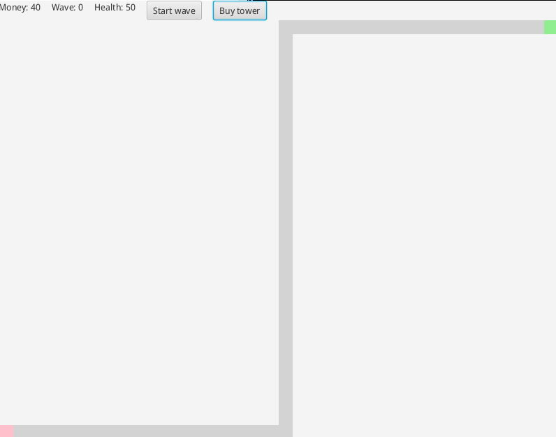
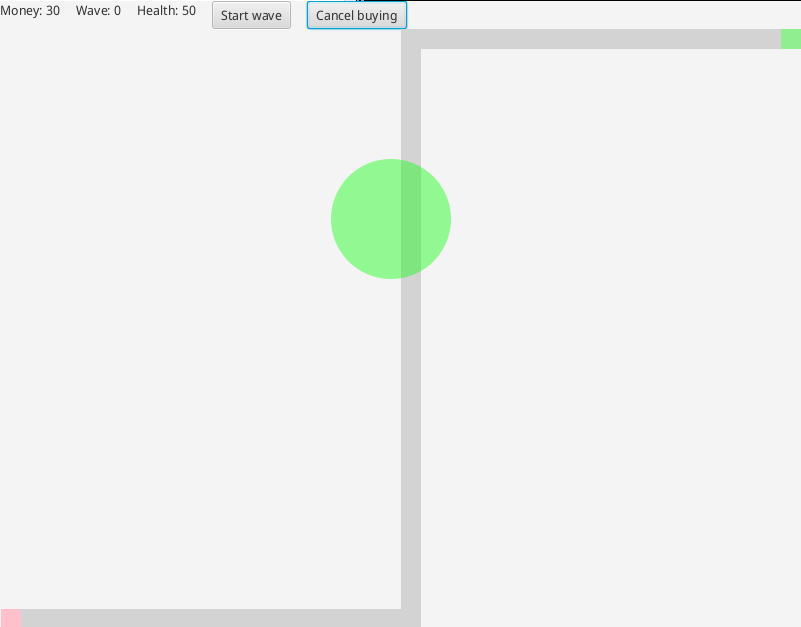
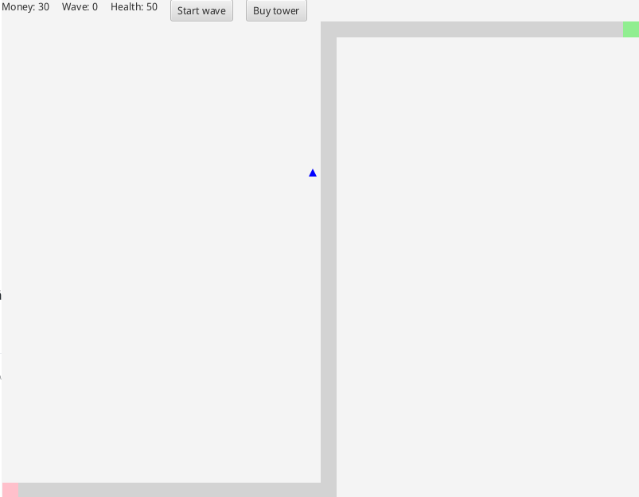
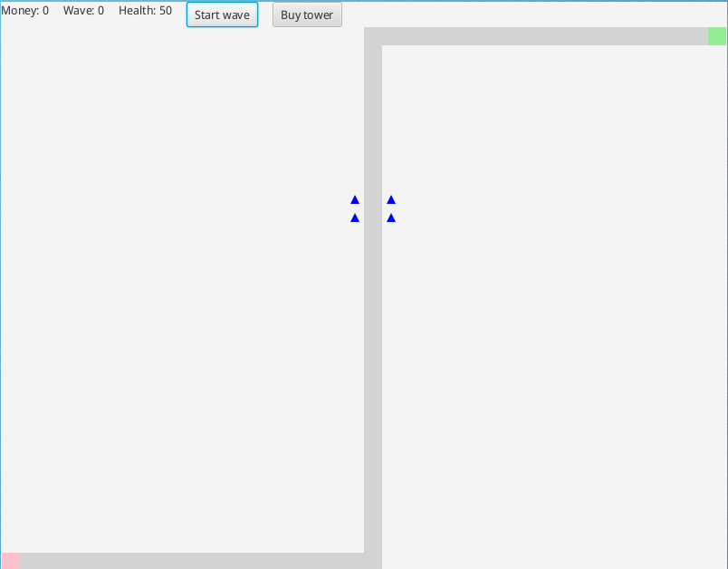
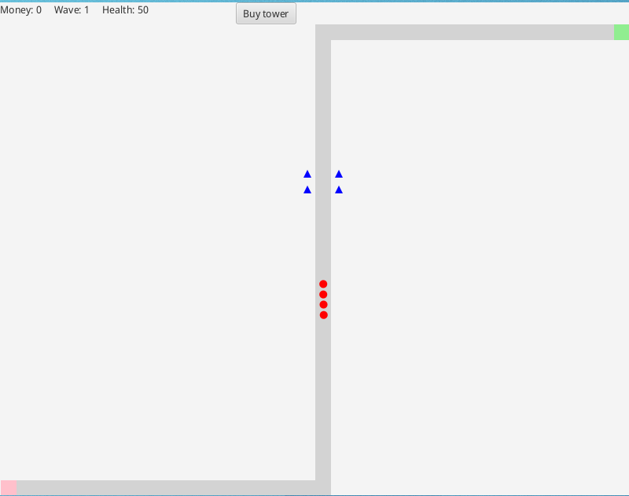
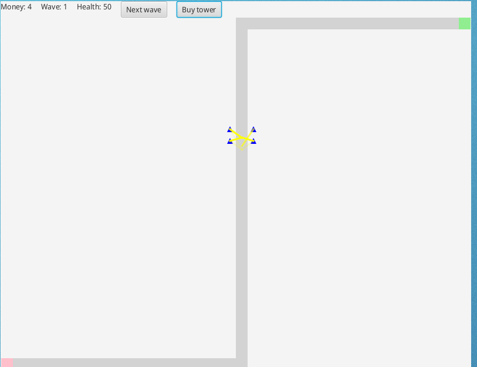

# Käyttöohje

Lataa uusin TowerDefense-versio.jar [julkaisuista](../../../releases).

## Pelin käynnistäminen

Pelin saa käyntiin komennolla `java -jar TowerDefense-versio.jar` tai
käynnistämällä .jar-tiedoston graafisesta käyttöliittymästä.

## Tornien osto

Ennen mitään muuta, kannttaa ostaa niin paljon torneja kuin voi.

Tornien osto tapahtuu "Buy tower" -napista, ja yhden tornin hinta on 10.

Sitten torni pitää sijoittaa sopivalle paikalle, mahdollisimman lähelle tietä.
Tämä alkaa siirtämällä hiiri haluttuun paikkaan.

Jos alue on vihreä, niin tornin paikka on vapaa ja tornin voi sijoittaa
klikkaamalla kiirellä.

## Hyökkäysaallon aloittaminen

Kun olet valmis, aloita peli "Start wave" -napista.

Viholliset lähtevät liikkeelle.

Tornit puollustavat vaaleanvihreää ruutua eli tukikohtaa vihollisilta.

Kun kaikki viholliset ovat kadonneet ruudulta, voit jo aloittaa seuraavan
aallon. Kannattaa muistaa ostaa lisää torneja aina kun voi.
